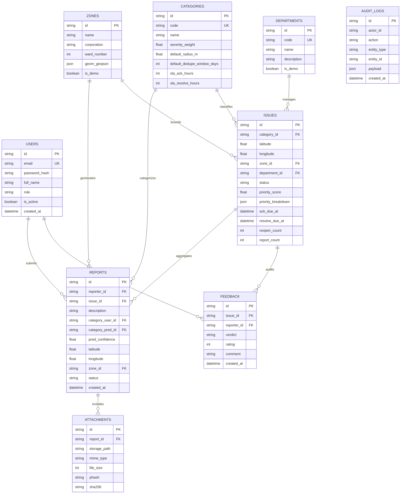

# Entity Relationship Diagram (ERD)

```mermaid
erDiagram
  USERS ||--o{ REPORTS : submits
  USERS ||--o{ FEEDBACK : verifies
  ZONES ||--o{ REPORTS : geolocates
  ZONES ||--o{ ISSUES : bounds
  DEPARTMENTS ||--o{ ISSUES : manages
  CATEGORIES ||--o{ REPORTS : categorizes
  CATEGORIES ||--o{ ISSUES : classifies
  ISSUES ||--o{ REPORTS : aggregates
  REPORTS ||--o{ ATTACHMENTS : includes
  ISSUES ||--o{ FEEDBACK : audits

  USERS {
    string id PK
    string email UK
    string password_hash
    string full_name
    string role
    boolean is_active
    datetime created_at
  }

  ZONES {
    string id PK
    string name
    string corporation
    int ward_number
    json geom_geojson
    boolean is_demo
  }

  DEPARTMENTS {
    string id PK
    string code UK
    string name
    string description
    boolean is_demo
  }

  CATEGORIES {
    string id PK
    string code UK
    string name
    float severity_weight
    float default_radius_m
    int default_dedupe_window_days
    int sla_ack_hours
    int sla_resolve_hours
  }

  ISSUES {
    string id PK
    string category_id FK
    float latitude
    float longitude
    string zone_id FK
    string department_id FK
    string status
    float priority_score
    json priority_breakdown
    datetime ack_due_at
    datetime resolve_due_at
    int reopen_count
    int report_count
  }

  REPORTS {
    string id PK
    string reporter_id FK
    string issue_id FK
    string description
    string category_user_id FK
    string category_pred_id FK
    float pred_confidence
    float latitude
    float longitude
    string zone_id FK
    string status
    datetime created_at
  }

  ATTACHMENTS {
    string id PK
    string report_id FK
    string storage_path
    string mime_type
    int file_size
    string phash
    string sha256
  }

  FEEDBACK {
    string id PK
    string issue_id FK
    string reporter_id FK
    string verdict
    int rating
    string comment
    datetime created_at
  }

  AUDIT_LOGS {
    string id PK
    string actor_id
    string action
    string entity_type
    string entity_id
    json payload
    datetime created_at
  }
```
